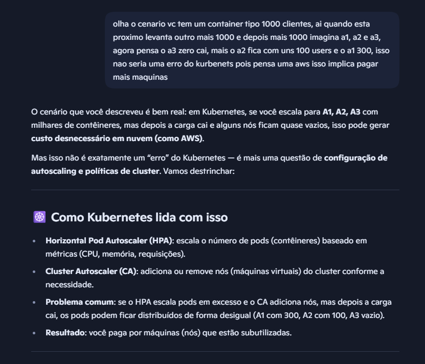
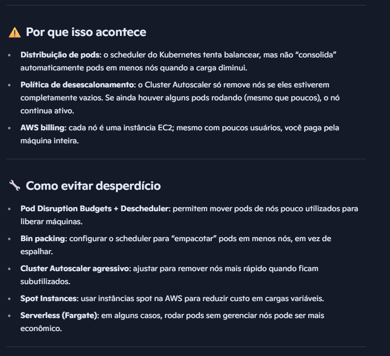
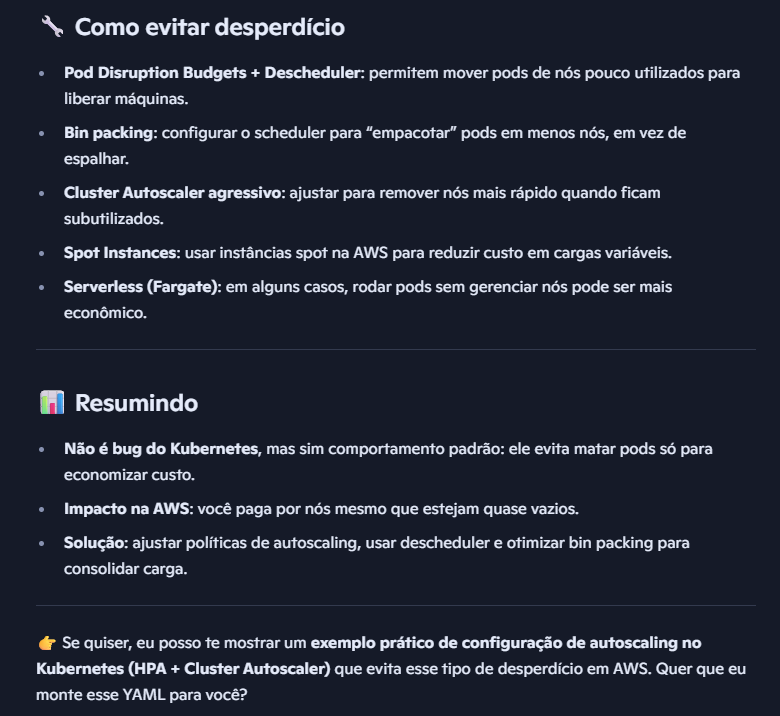

## HOJE 
Pensando no que fazer e novas tendencias perguntei para IA, ai mano o que tem de novo mesmo cara, os negocios vao
mandar no mercado além de vocÊ mesmo IA, ai:
Web ASSEMBLY,  DevSecOps, AIOPS, GITOps, ai eu pensei será que posso ficar na frente de todos os otários, tem uns
tanto otário cara, eles amam ficar fazendo joguinho, uma porrada de otário, eu continuoi aqui, devo ficar jogando
algum joguinhoi, no mais alguns idiotas, ate agora nada..

AI eu pensei cara como voce coda, usa vscdode, git, bota na sua infraestrutura gitaction ou na mao. mais e a tendencia
de Platform Engineering, olha eu tenho minha propria cloud que posso usar e fazer as coisas, o que falta e integracao
com prometheus ou grafana que posso embutir no codigo e pegar poucas linhas de codigos. Por que eu falei de como
eu levanto algo!!! Minha diferenca que eu possuo uma cloud de api docker e posso mudar para atender o que preciso,
mais especificamente e quase uma Platform Engineering, no mais estou pensando em fazer uma api com curl e fazer
uma integracao com meu vscode, o mais seria talvez no mesmo git push, quando subir e ja era. no mais talvez os
testes unitários com phpunit e de integracao no proprio vscode, e depois git, e depois CD. Acho que com métricas
fica ja legal o que falta mais eu penso criar algo mais básico.

Olha eu terminei minha pós que comecei ano passado em novembro, e estava pensando em colocar kurbenets, mais uma 
questão até por ter uma cloud com docker e poder simular por código essa capacidade de containerees distribuídos.

